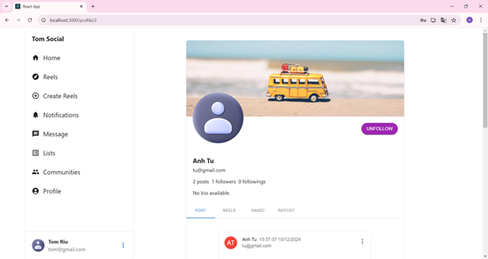

# Social Media Website

This repository contains the source code and documentation for a dynamic **Social Media Platform** developed as product of Basic Internship subject in **Posts and Telecommunications Institute of Technology**. 

The project aims to enhance connectivity, user engagement, and content sharing through a user-friendly and feature-rich platform.

---

## Features

### Authentication and User Management
- Secure user registration, login, and logout.
- Password recovery using email verification.
- Profile view and editing.
- Follow and unfollow users.

### Post Interactions
- Create, like/unlike, save/unsave, and delete posts.
- Add comments to posts.

### Real-Time Communication
- Real-time chat functionality using WebSocket API.

### Search and Discovery
- Search for users and posts with advanced filters.

### Responsive Design
- Optimized for performance across various devices and screen sizes.

---

## Technologies Used

### Frontend
- **HTML, CSS, JavaScript**: Structure and basic interactivity.
- **React.js**: Component-based UI development.
- **Redux**: State management.
- **MUI**: Pre-styled UI components.
- **Tailwind CSS**: Utility-first CSS framework.
- **Formik**: Form management and validation.

### Backend
- **Java**: Programming language for backend development.
- **Spring Boot**: Backend framework for API development.
- **Spring Security**: Authentication and authorization.
- **Spring Data JPA**: Data persistence with MySQL.
- **Spring Mail**: Email sending for password recovery.
- **Spring Boot DevTools**: Enhances development experience.
- **JWT**: JSON Web Tokens for authentication.
- **Lombok**: Reduces boilerplate code.

### Database
- **MySQL**: Relational database for storing user and platform data.

### Real-Time Features
- **WebSocket API**: Enables instant messaging capabilities.


### Media Storage
- **Cloudinary API**: Secure and efficient image storage.
---

## Project Structure
- **Frontend**: Located in the `frontend` directory.
- **Backend**: Located in the `backend` directory.
- **Documents**: Having all relevant documentation in the `documents` directory.
- **Images**: Images used to demonstrate the application in the `images` directory.

---

## Installation

### Prerequisites
- ReactJS and npm
- Java (JDK 17 or above)
- MySQL

### Steps
1. Clone the repository:
   ```bash
   git clone https://github.com/TomRiu/social-media-project.git
   cd social-media-website
   ```

2. Set up the backend:
   ```bash
   cd server
   ./mvnw spring-boot:run
   ```

3. Set up the frontend:
   ```bash
   cd client
   npm install
   npm start
   ```

4. Configure the database and email address:
    - Update the `application.properties` file in the `backend` directory with your MySQL and email application credentials.

---

## Demo

### Screenshots
Below are some screenshots demonstrating the application features:

1. **Register Page**
    

2. **Login Page**
   

3. **Forgot Password**
   

4. **Reset Password**
   

5. **Create Post**
   

6. **Home and Search**
   

7. **Like, Comment, Save Posts**
   


8. **Get My Profile with My Posts**
   

9. **Get My Profile with My Saved Posts**
   

10. **Other User Profile**
   

11. **Real-Time Chat and Messaging**
   


### PDF Document
A detailed documentation of the project is available in the [documentation.pdf](documents/FINAL_REPORT_OF_BASIC_INTERNSHIP.pdf) file.

### Presentation Walkthrough
A complete walkthrough of the platform is included in the [presentation.pptx](documents/SOCIAL_MEDIA_WEBSITE_PRESENTATION.pptx) file.

---

## License
This project is licensed under the [MIT License](LICENSE).

---

## Future Enhancements
- **Notifications**: Real-time updates for likes, comments, and follows.
- **Stories**: Temporary posts similar to other social media platforms.
- **Reels**: Short-form video content creation and viewing.
- **Enhanced Error Handling**: Sophisticated feedback mechanisms for better user experience.

---

## Contributing
Contributions are welcome! Please follow these steps:
1. Fork the repository.
2. Create a feature branch.
3. Submit a pull request with a detailed description of your changes.

---

## Acknowledgments
Special thanks to **Kim Ngọc Bách**, the guiding lecturer, and everyone who contributed to this project.

---

Feel free to explore the source code, and don’t forget to star the repository if you find it useful!
